# Vietnamese Speech-enhancement with Wave U-net

<a href="https://wandb.ai/nmd2000/Speech-enhancement/"></a>

<a href="https://share.streamlit.io/manhdung20112000/speech-enhancement/main/app.py"></a> 


Table of Contents
================
* [Abstract](#abstract)
* [Dataset](#dataset)
* [Training](#training)
* [Experiment tracking & Tuning hyperparameter](#experiment-tracking-&-tuning-hyperparameter)
* [Result](#result)
* [Deployment](#deployment)
    * [Streamlit share](#streamlit-share)
    * [Localhost run](#Localhost-run)
* [Reference](#reference)

Abstract
========
Speech enhancement is the task of improving the intelligibility and quality of a speech signal that may have been corrupted with noise or distortion, causing loss of intelligibility or quality and compromising its effectiveness in communication.

The gif below represent the concept of speech enhancement, where the input audio has been processed to reduce the signal which corresponding to the noise.


*Source: Vincent Belz [[1]](#1)*

This repository is our assignment for Course: Speech Processing (INT3411 20), where we attempt to use U-net [[2]](#2) for Speech Enhencement task and deploy a simple web application.
 
Dataset
=======

Audios have many different ways to be represented, going from raw time series to time-frequency decompositions. By representing with Spectrogram which consist of 2D images representing sequences of Short Time Fourier Transform (STFT) with time and frequency as axes, and brightness representing the strength of a frequency component at each time frame, the input of the model will be noisy voice spectrogram and the grouth truth will be clean voice spectrogram.


*Source: Vincent Belz [[1]](#1)*

**The clean voices** were approximately 10 hours of reading Vietnamese articles by us, student of Speech Processing Course at UET. 

**The environmental noise** were gathered from ESC-50 dataset [[3]](#3). However, we only focus on 20 classes which we believe are the most relevant to daily environmental noise. These classes are: 

|                 |   |             |   |                  |   |
|-----------------|---|-------------|---|------------------|---|
| vacuum cleaner  |   | engine      |  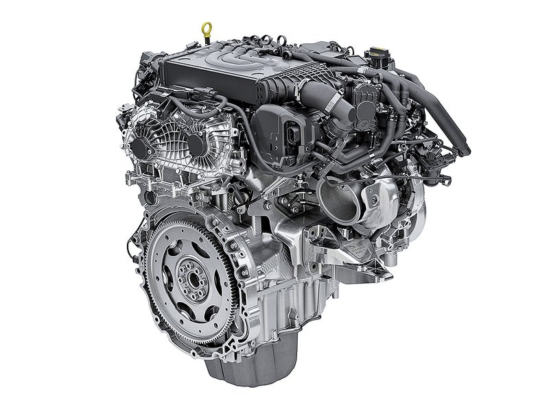 | keyboard typing  |  |
| fireworks       |   | mouse click |   | footsteps        | 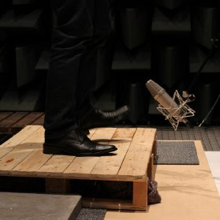  |
| clapping        |  | clock alarm |   | car horn         |   |
| door wood knock |   | wind        |   | drinking sipping |   |
| washing machine | 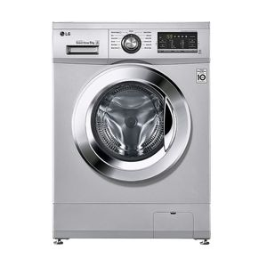 | rain        |   | rooster          |   |
| snoring         | 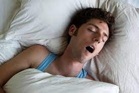 | breathing   | 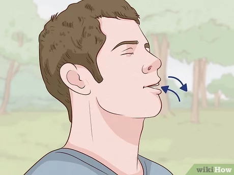  | toilet flush     |   |
| clock tick      | 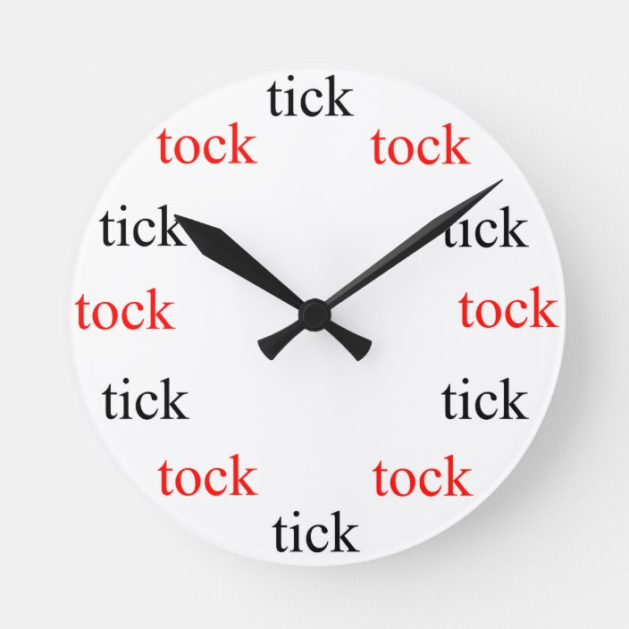  | laughing    |   |                  |   |


We used public source by Vincent Belz [[1]](#1) to transform the datasets, from audios to spectrograms. Audios were sampled at 8kHz and we extracted windows slighly above 1 second. Noises have been blended to clean voices with a randomization of the noise level (between 20% and 80%). 

We publish our dataset as `Artifact` in this project worksplace at Weight&Bias (WB). We highly recommend to take a look what we've done at WB:

<a href="https://wandb.ai/nmd2000/Speech-enhancement/"></a>

Training
========
Inorder to take input as mel spectrogram image of audio and output as mel spectrogram image of detected noise, we are focusing on U-net, a model was initially developed for Bio Medical Image Segmentation [[2]](#2), for adapting to denoise spectrograms.


*Source: Vincent Belz [[1]](#1)*

The original U-net's only contains convolutional and deconvolutional (transpose convolutional). In this project, inspired by the architecture of residual block [[5]](#5), we attempt to introduce some new skip connection to the Unet architecture. The architecture of the Unet based Resnet is shown below:

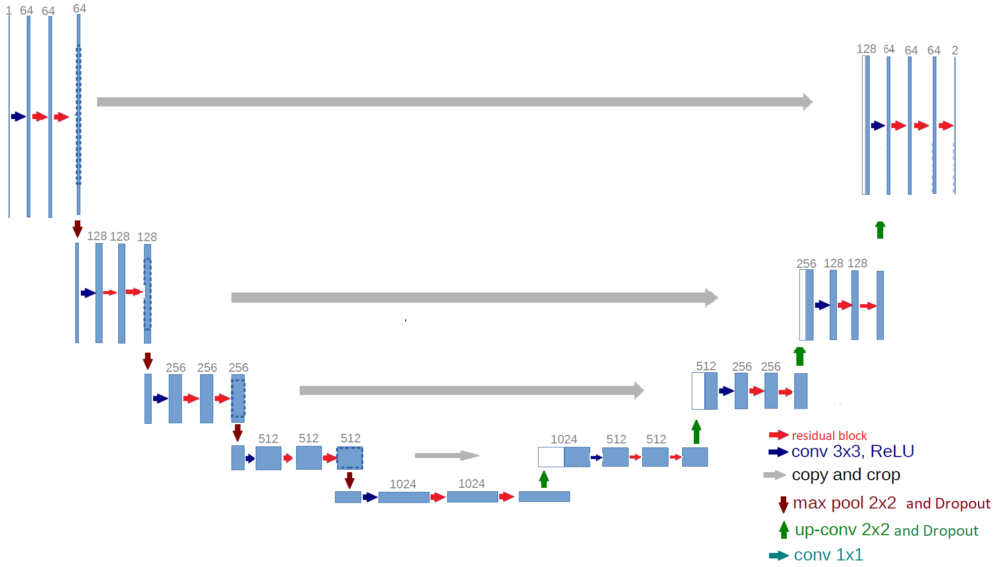

However, experimence showed some downside while using this architecture than the original. We are still researching deeper into this Unet based Resnet model and the process is not finished yet. **Therefore, use at your own risk.** 

🚀 To recreate our experiments, train a model with specific model, learning rate, dropout rate, ... by running:
```
$ python train.py [--args config]

optional arguments:
  -h, --help            show this help message and exit
  --run RUN             run name
  --model MODEL         initial weights path
  --dropout DROPOUT     declear dropout rate
  --epoch EPOCH         number of epoch
  --startfm STARTFM     architecture start frame
  --batchsize BATCHSIZE
                        total batch size for all GPUs (default:
  --lr LR               learning rate (default: 0.0001)
  --tuning              no plot image for tuning
```

Experiment tracking & Tuning hyperparameter
==================
For tracking experiment, we used an awesome tool named Weight & Bias [(W&B)](https://docs.wandb.ai/). W&B provided us a stuning dashboard for loging data while training, tracking experiment realtime ☕.

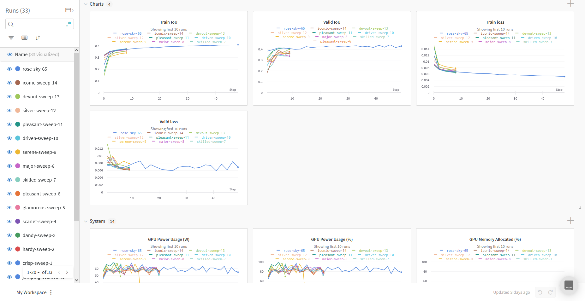

Once a again, we *highly encourage* you to take a look at our project workspace inorder to see more about our training process:

<a href="https://wandb.ai/nmd2000/Speech-enhancement/"></a>

Weight & Bias also provided a tool named `Sweep` for us to tuning our hyperparameter. The tool corresponsed to start some runs and search for better hyperparameter inorder to maximize or minimize our configed goal. Therefore, we initialized 2 sweep for each model (U-net and U-net Res) to maximize their `Valid IoU`. 

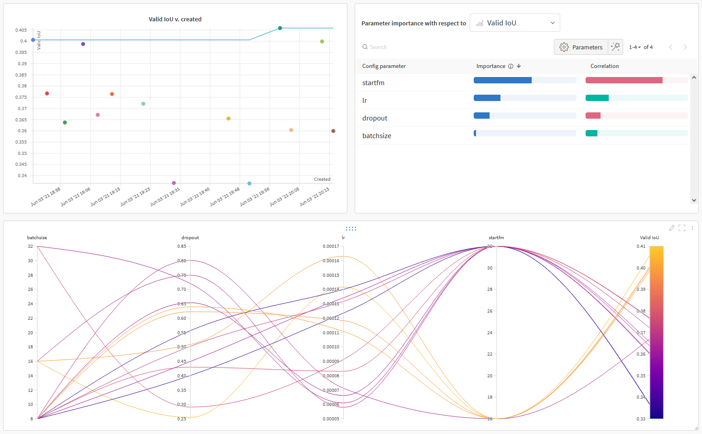

*Hyperparameter tuning for U-net Res*

Result
======
While you are training, your W&B dashboard might log somet image like shown. This is mel spectrogram of the data that input and output in your model. From `left` to `right`, the 1st is the spectrogram of **noisy audio**, the 2nd is the spectrogram of **noise ground truth**, the 3rd is our model *prediction*.

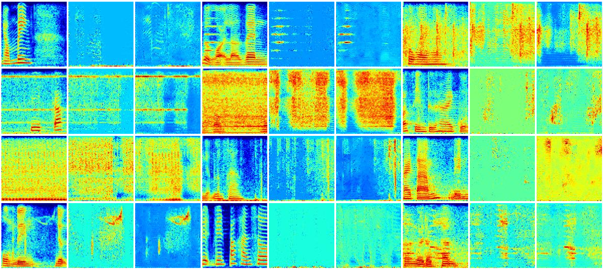

With the hyperparameter from tuning process, we have train 2 model with the config as shown:

|             | Start frame | Batch size | Learning rate | Dropout rate | Params<br>(M)   | IoU<sup>train | IoU<sup>val |
|-------------|-------------|------------|---------------|--------------|-----------------|-----------|----------|
| Unet        | 32          | 8         | 0.0000826     | -            | 7.76            | 51.14     | **46.14**|
| Unet Resnet | 16          | 8         | 0.0001416     | 0.3          | 7.08            | 41.0      | 44.14    |

Deployment
=========
To build a simple web application for demonstrate, we are using **Streamlit**, which is amazing tool for guys who don't know much about *html, css and so on*. With **Streamlit**, we can code our back-end with Python, which is very cool and easy to get started with.

Streamlit share
--------------
We have deployed our application into **Streamlit.share** which provided 1 CPU with 800MB RAM and 800MB delicated storage for our application. 

<a href="https://share.streamlit.io/manhdung20112000/speech-enhancement/main/app.py"></a>

*Note:* In case you see the app is sleeping, that is because **Stream.share** limitation, just wake it up. Many thanks

Localhost run
------------
In order to run our application in your own machine or vitural machine, install **Streamlit** and orther dependencies, run:
```
$ pip install -r requirements.txt
```

To run app **Streamlit**, run:
```
$ streamlit run app.py
```

After that, if you see the same thing as in this video, you are good to go.
[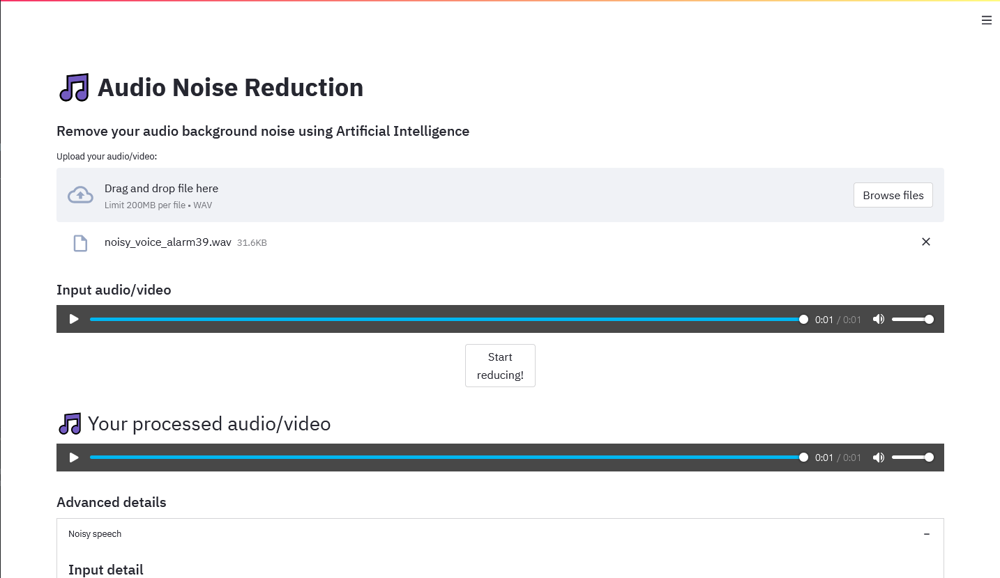](https://youtu.be/gzXcjEgXLno)


Team member
===========
Dung Nguyen Manh: 
- :octocat: [manhdung20112000](https://github.com/manhdung20112000)  
- :email: [manhdung20112000@gmail.com](mailto:manhdung20112000@gmail.com)

Nguyen Phuc Hai: 
- :octocat: [HaiNguyen2903](https://github.com/hainguyen2903) 


Reference
============
<a id="1">[1]</a> 
Vincent Belz, "Speech-enhancement". Github:https://github.com/vbelz/Speech-enhancement.

<a id="2">[2]</a> 
Jansson, Andreas, Eric J. Humphrey, Nicola Montecchio, Rachel M. Bittner, Aparna Kumar and Tillman Weyde.Singing Voice Separation with Deep U-Net Convolutional Networks. ISMIR (2017). [https://ejhumphrey.com/assets/pdf/jansson2017singing.pdf]

<a id="3">[3]</a> 
Karol J. Piczak. 2015. ESC: Dataset for Environmental Sound Classification. In Proceedings of the 23rd ACM international conference on Multimedia (MM '15). Association for Computing Machinery, New York, NY, USA, 1015–1018. DOI:https://doi.org/10.1145/2733373.2806390

<a id="4">[4]</a> 
Grais, E. M., & Plumbley, M. D. (2017, November). Single channel audio source separation using convolutional denoising autoencoders. In 2017 IEEE global conference on signal and information processing (GlobalSIP) (pp. 1265-1269). IEEE.

<a id="5">[5]</a> 
Karen Simonyan and Andrew Zisserman. Very Deep Convolutional Networks for Large-Scale Image Recognition. 2015. arXiv: 1409.1556 [cs.CV].
